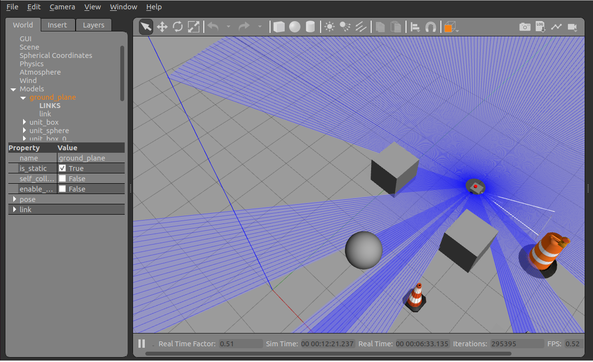
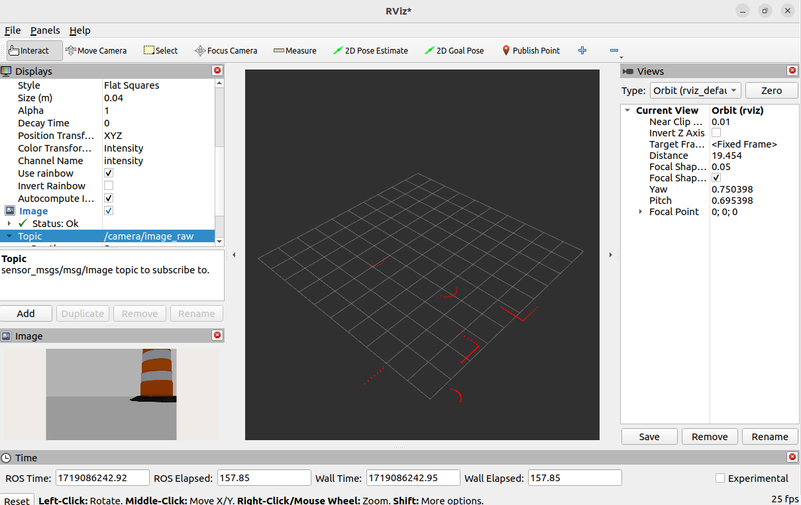
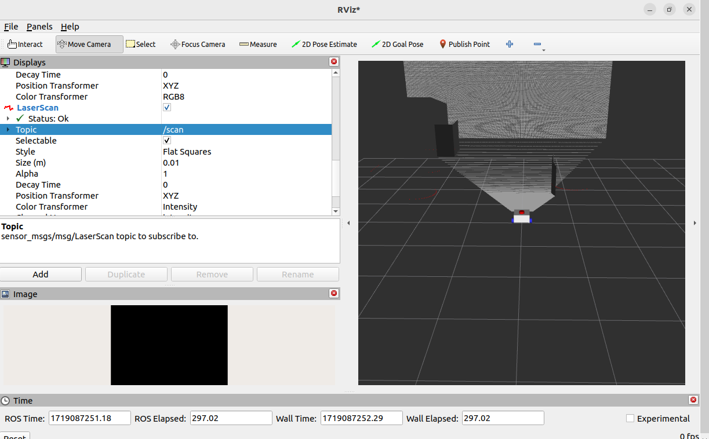
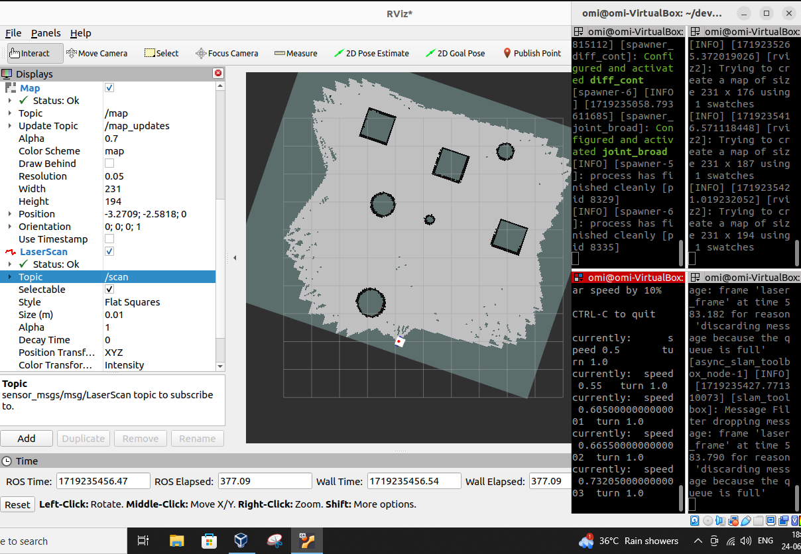
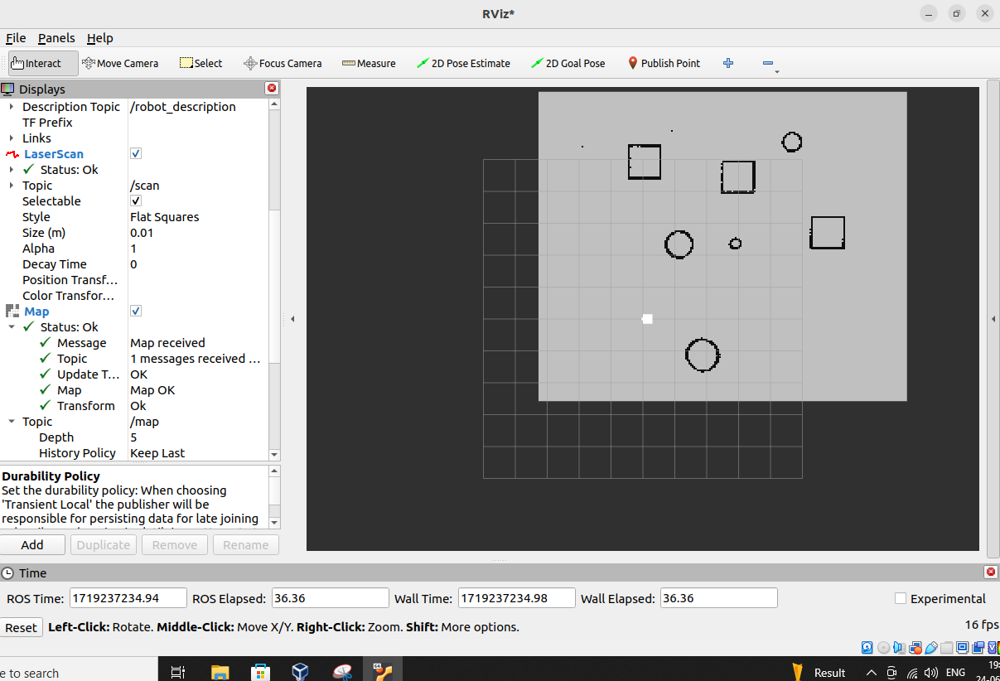
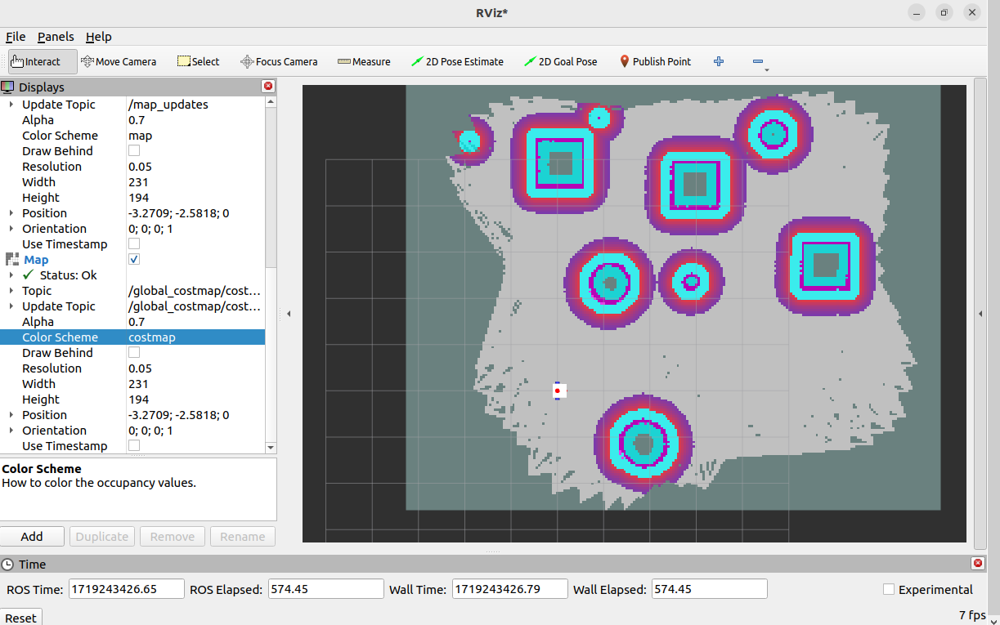

#**My_bot: Autonomous Navigation Robot**

**Overview**

My_bot is an autonomous navigation robot equipped with a depth sensor and a LiDAR sensor. It leverages SLAM (Simultaneous Localization and Mapping) to build a detailed map of its environment and utilizes the ROS Navigation Stack (NAV2) to autonomously generate and follow paths between any two points. All simulations for My_bot are available in Gazebo and RViz, making it an excellent tool for both educational and research purposes in the field of robotics.

**Features**

**Autonomous Navigation**: Capable of self-navigating between specified points. 
**Depth Sensor**: Provides 3D vision for obstacle detection and environment mapping. 
**LiDAR Sensor:** Enhances environment scanning with precise distance measurements. 
**SLAM**: Builds and updates maps in real-time for effective navigation. 
**ROS Navigation Stack (NAV2)**: Utilizes advanced algorithms for path planning and obstacle avoidance. 
**Simulations**: Fully integrated with Gazebo and RViz for simulation and visualization. 
 
 

**USAGE**
  
**1) LAUNCHING MY_BOT in GAZEBO** 
use command: **ros2 launch my_bot launch_sim.launch.py world:=./src/my_bot/worlds/Cone_and_cubes.world**

Here, Gazebo will launch in "cones and cubes" world. If you want to open in empty world gazebo, just type: ros2 launch my_bot launch_sim.launch.py

*The launched bot will be controlled using ros_control. If it doesnt respond, go to robot.urdf.xacro and uncomment gazebo_control.*

**2) OPENING RVIZ2**

This can be executed by simply typing**rviz2** in terminal 

**3) OPENING TELEOP KEYBOARD**

To drive the robot around the world, you can use teleop twist, this can give you a taste of LIDAR and depth camera.

One can access this through:
**ros2 run teleop_twist_keyboard teleop_twist_keyboard --ros-args -r /cmd_vel:=/diff_cont/cmd_vel_unstamped**

**4) Running SLAM and generating map**

to generate the map,  
1) Launching SLAM toolbox: type in terminal **ros2 launch slam_toolbox online_async_launch.py slam_params_file:=./src/my_bot/config/mapper_params_online_async.yaml use_sim_time:=true** 

2)After this, you can add Map in rviz2, changinng its description to /map 

As you drive, You will start to build a map of the environment. 
You can view my saved maps under worlds folder in src/my_bot 

**5) Launching NAV2**  
give the command:
**ros2 launch nav2_bringup navigation_launch.py use_sim_time:=true** 

after this, you can add another map in rviz2, and select this to costmap 

you can now set an end goal on rviz using 2D Goal pose, and watch your robot drive on its own!!!

**IMAGES OF MY_BOT SIMULATIONS**  

1) Viewing LIDAR  

  

The bot in gazebo and rvis showing Lidar images of simulation. One can notice that size has been set to 0.04, adjust it according to your own purpose.  

2) Depth Camera 
 

This image shows how RVIz shows the reading of depth camera, Notice image isnt available, some slight error in this.  
**For image, one can use normal camera by changing few things in robot.urdf.xacro**  

3) Map Generation  
 

This is how you can generate the map using teleop twist and slam toolbox 
 

this is the loaded map on rviz. 

4) Autonomus Navigation 

 

This shows the cost map, from here, you can set the 2D goal pose.

